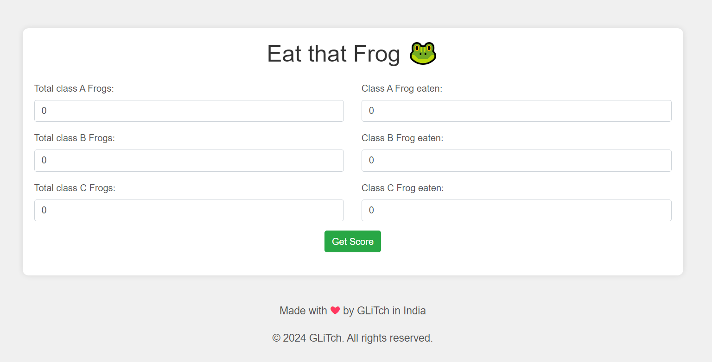

# Task Completion Calculator

## Overview
The Task Completion Calculator is a simple web application built using HTML, CSS, and JavaScript. It allows users to calculate their completion score based on the number of tasks completed in different categories.

## Features
- Users can input the total number of tasks and the number of tasks completed for each category.
- The application calculates the completion score based on a weighted system, where tasks in different categories contribute different points to the overall score.
- Users can view their completion score as a percentage.

## Installation
To use the Task Completion Calculator, simply download the project files and open the `index.html` file in a web browser.

## Usage
1. Input the total number of tasks for each category (Class A, Class B, and Class C) in the corresponding input fields.
2. Input the number of tasks completed for each category.
3. Click the "Get Score" button to calculate the completion score.
4. The completion score will be displayed as a percentage below the button.

## Screenshots

## Technologies Used
- HTML
- CSS (Bootstrap framework for styling)
- JavaScript

## Credits
This project was created by [Your Name].

## License
This project is licensed under the [MIT License](LICENSE).

---

Feel free to customize the README further with additional information or sections as needed.
