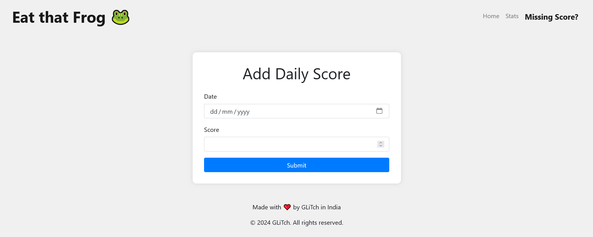

# Eat that Frog 🐸 v1.6.1

Welcome to Eat that Frog 🐸 v1.6.1! This web application is designed to help you track and calculate your task completion progress across different categories. With its user-friendly interface and advanced features, Eat that Frog 🐸 empowers you to manage your tasks efficiently and stay organized.


## New Features in v1.6.1

- **Secure Note**: Users can create secure note. protected by password.


## Features

- **Task Entry**: Easily input the total number of tasks and the number of completed tasks for each category (A, B, C) using user-friendly input fields. This feature allows for efficient tracking of task completion progress in different categories.
- **Advanced Calculation**: The application performs advanced calculations to determine the completion percentage based on weighted scores for each category of tasks. By assigning weights to different task categories, users can prioritize and gauge their progress more accurately.
- **Responsive Design**: Built with Bootstrap, the application boasts a responsive and mobile-friendly layout. Whether accessed from a desktop, tablet, or smartphone, users can enjoy a seamless and optimized experience across various devices.
- **Graphical Representation**: Visualize daily scores with a line chart using Chart.js integration. This graphical representation enhances data comprehension by illustrating trends and patterns in task completion over time, empowering users to make informed decisions and adjustments.
- - **Note Entry**: Now you can jot down your thoughts, ideas, or important information using the new note-taking feature.
- **Date Picker**: Easily select the date for each note entry using the integrated date picker, ensuring accurate timestamping.
- **Search and Filter**: Effortlessly search and filter through your notes based on keywords or specific dates, enhancing accessibility and retrieval.
- **Responsive Design**: The note-taking feature is seamlessly integrated into the application's responsive design, ensuring optimal viewing and functionality across devices.


- **Navigation Bar**: Navigation buttons are provided for easy navigation within the site, ensuring a smooth user experience.
- **Slider Menu**: The addition of a slider menu enhances usability, especially for mobile devices.
- **Persistent Storage**: Daily scores are automatically saved in the browser's local storage, ensuring data persistence across sessions. This feature allows users to revisit and track their historical performance without the risk of data loss.
- **Data Reset**: Users have the option to reset all stored data with a simple command. By executing `localStorage.clear()` in the browser console, users can wipe all saved scores and start afresh, providing a clean slate for tracking new tasks.
- **Export Data**: Users can now export their data in Excel format, facilitating further analysis and sharing.


- **Add Missing Scores**: If users forget to input a score for a specific day, they can easily rectify the omission by clicking the "Missing Score?" button. This button redirects users to a dedicated page where they can manually add missing scores for any date, ensuring comprehensive and accurate data collection.



- **Mobile-Friendly Design**: The application's responsive design ensures an optimal viewing experience across various devices, including desktops, tablets, and smartphones. Users can seamlessly access and interact with the application on any device, enhancing convenience and accessibility.
- **Weekly Score**: Users can view weekly average scores for better understanding and tracking of their progress.
- **Feedback and Support**: Users can provide feedback or seek assistance by opening an issue on the GitHub repository, helping to improve the application and provide better support to the community.

## Installation

1. Clone the repository to your local machine:

   ```
   git clone https://github.com/glitch7584/eatthatfrog.git
   ```

2. Navigate to the project directory:

   ```
   cd eatthatfrog
   ```

3. Open `index.html` in your web browser to access the application.

4. Alternatively, visit [Eat that Frog](https://eatthatfrog.netlify.app/).

## Usage

1. **Task Entry**: Fill in the total number of tasks and the number of completed tasks for each category (A, B, C) in the respective input fields.

2. **Calculate Score**: Click the "Get Score" button to calculate your completion percentage based on the entered task data.

3. **View Daily Scores**: Check the list of daily scores displayed below the input fields to see your past performance. Each entry includes the date and corresponding score.

4. **Visualize with Chart**: The line chart below the daily scores visually represents your progress over time, making it easier to track trends and improvements.

5. **Reset Data**: If needed, you can reset all stored data by opening the browser console and running `localStorage.clear()`. This action will clear all saved scores and start fresh.

6. **Add Missing Scores**: If you missed entering a score for a specific day, click the "Missing Score?" button located at the top left corner of the page. This option redirects you to a page where you can manually add missing scores for any date.

7. **Explore Weekly Scores**: Gain insights into your weekly performance by filtering and viewing scores for specific weeks. Use the filter options provided to select the desired week or month and visualize your progress over time.

8. **Note Taking**: Utilize the new note-taking feature to capture important information, ideas, or thoughts. Easily

search and filter notes based on keywords or dates for quick access and reference.

9. **Mobile-Friendly Design**: Enjoy a seamless experience across devices with the responsive design optimized for desktop, tablet, and mobile screens.

10. **Feedback and Support**: Have feedback or need assistance? Feel free to reach out by opening an issue on the GitHub repository. Your input helps us improve the application and provide better support to our users.

## License

This project is licensed under the [MIT License](LICENSE).

## Version History

- **v1.6.1**:
- Ui bug fix.

- **v1.6.0**:
- Added a secure note funtionality.

- **v1.5.0**:

  - Added note-taking feature for capturing important information and ideas.
  - Enhanced search and filter functionality to include notes based on keywords and dates.
  - Improved user experience with responsive design and integrated date picker.

- **v1.4.0**:

  - Updated README with version history and documentation.
  - Added new features and updated design.
  - Manually score adding.

- **v1.3.0**:

  - Added daily score view and graph.
  - Improved data storage and reset functionality.
  - Enhanced graphical representation.

- **v1.2.0**:

  - Added animation and aesthetic improvements.
  - Updated README and documentation.

- **v1.0.0**:
  - Initial release.

## Support

If you encounter any issues or have suggestions for improvements, please [open an issue](https://github.com/glitch7584/eatthatfrog/issues) on GitHub.

```

This updated README reflects the addition of the note-taking feature, along with enhancements to the search and filter functionality, providing users with more comprehensive task management capabilities.
```
